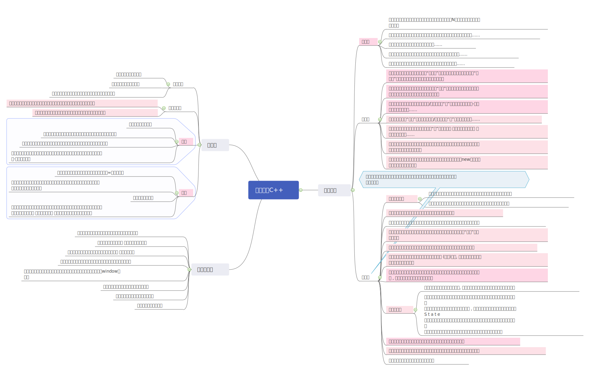

 
设计模式2

 -

[toc]

> 三种大类的设计模式侧重点不同，难道创建型模式，就没有行为了吗？显然不是。
如果真的细分，分不清。就比如 同是行为型的 策略模式和状态模式，他们的类图相同。如果从结构上看，是不可能分清的。

- 创造：侧重于 `New（）`代码写在哪里。【如何new？】
- 结构：侧重于 多个类型/对象 形成的最终结构。该结构表述出 类型和类型的 之间的关系（`字段`的值）。【如何设计类型字段？】
- 行为：侧重于 多个类型/对象 之间的函数调用。（`函数`）【等待下回分解……】
- 单类型、N类型：单类型比较简单。N类型借助“表格”进行分析。

> 在表述“意识”时，请注意“对象”“类型”的表述正确。

> **结构型设计模式 关注结构。 结构映射出 类型之间的关系。 换句话说，关注类和类之间的 字段关联。 因为类和类之间肯定要协同 工作。协同工作肯定要临时存储 协同类型的引用。**
而设计模式的引用

意识表：
-

|模式|意识|
|-|-|
适配器【单】|组合新旧类型，形成“**适配器**”结构，使得新旧模块可以通过该“适配器”交互，管道链接新旧。时考虑使用该模式。
桥接模式【N】|组合**垂直抽象的不同类型**，形成“**桥状**”结构，使得两个不同方向的抽象类型可以组合在一起。时考虑使用该模式。
组合模式【N】|组合树形关系的不同类型/对象，形成“**树**”结构（也可能是局部-整体结构）。时，考虑……
装饰模式【N】| 组合“链型”关系的不同类型/对象，形成“链”结构。时，考虑……
外观模式【单】|组合新类型和旧系统，形成“伞”结构，使得 新类型和旧系统可以 良好交互时，考虑……
享元模式【单】|无所谓结构，更像是行为。当使用数据对象相同，为了节约内存时，使用该模式，共享该数据对象。
代理模式【单】|弱化结构，强化行为。当需要在被代理者不方便（还未new）下执行时，考虑使用代理模式。

# 适配器模式

> 定义：
将一个类的接口转换成为客户希望的另外一个接口。Adapter模式使得原本由于接口不兼容而不能仪器工作的那些类可以一起工作。

手段/类型的关系
- 
适配器继承自新、关联至旧。——适配器。

# 桥接模式

> 定义：
将抽象部分与它的实现部分分离，使他们都可以独立地变化。

二维表： N种类型，只有两种抽象、且抽象垂直呈现二维。

<table>
   <col width="79.92" style='width:47.95pt;'/>
   <tr height="24" style='height:14.40pt;'>
    <td height="24" width="79.92" style='height:14.40pt;width:47.95pt;' x:str><B>系列↓</td>
    <td class="xl65" width="79.92" style='width:47.95pt;'></td>
    <td width="79.92" style='width:47.95pt;'></td>
    <td width="79.92" style='width:47.95pt;'></td>
    <td width="79.92" style='width:47.95pt;'></td>
   </tr>
   <tr height="24" style='height:14.40pt;'>
    <td class="xl66" height="24" style='height:14.40pt;' x:str>肯德基</td>
    <td class="xl67" rowspan="2" style='border-right:none;border-bottom:none;' x:str><B>商品→</td>
    <td class="xl68" rowspan="2" style='border-right:none;border-bottom:none;' x:str>鸡腿</td>
    <td class="xl68" rowspan="2" style='border-right:none;border-bottom:none;' x:str>汉堡</td>
    <td class="xl68" rowspan="2" style='border-right:none;border-bottom:none;' x:str>可乐</td>
   </tr>
   <tr height="24" style='height:14.40pt;'>
    <td class="xl66" height="24" style='height:14.40pt;' x:str>麦当劳</td>
   </tr>
  </table>

> 注：这里强制使用 肯德基作为例子，有点不合逻辑。

手段/关系
- 
系列聚合商品，形成桥面。 各自抽象的 具体实现 类型实现形成 桥墩。—— 桥接模式

开闭原则
- 
没有太大的问题。

# 组合模式

> 定义：
将对象组合成属性结构以表示“部分-整体”的层次结构。组合模式使得用户对单个对象和组合对象的使用具有一致性。

分析：
-

- 树形结构关键 点：树枝、树叶。

- - -

<table >
   <tr height="24" style='height:14.40pt;'>
    <td class="xl65" height="120" width="80" rowspan="5" style='height:72.00pt;width:48.00pt;border-right:none;border-bottom:none;' x:str><B>公司元素→</td>
    <td width="80" style='width:48.00pt;'></td>
    <td width="80" style='width:48.00pt;' x:str>公司</td>
    <td width="80" style='width:48.00pt;'></td>
    <td width="80" style='width:48.00pt;'></td>
    <td width="80" style='width:48.00pt;'></td>
   </tr>
   <tr height="24" style='height:14.40pt;'>
    <td x:str>人事部</td>
    <td x:str>技术部</td>
    <td x:str>子公司</td>
    <td colspan="2" style='mso-ignore:colspan;'></td>
   </tr>
   <tr height="24" style='height:14.40pt;'>
    <td colspan="2" style='mso-ignore:colspan;'></td>
    <td x:str>人事部</td>
    <td x:str>技术部</td>
    <td></td>
   </tr>
   <tr height="24" style='height:14.40pt;'>
    <td colspan="3" style='mso-ignore:colspan;'></td>
    <td x:str>程序组</td>
    <td x:str>美术组</td>
   </tr>
   <tr height="24" style='height:14.40pt;'>
    <td colspan="2" style='mso-ignore:colspan;'></td>
    <td x:str>李四员工</td>
    <td x:str>张三员工</td>
    <td></td>
   </tr>
  </table>

  

> 客户端持有公司元素地引用，进而实际指向员工或组织的的 对象。 

  开闭原则
  - 
  没有太大的问题。

# 装饰模式

  > 定义：
  动态地给一个对象添加一些额外地职责，就增加功能来说，装饰模式比生成子类更灵活。

  分析：
  - 
  关键：链式结构、有尾无头。

开闭原则
- 
> 客户持有链接 引用，进而实际指向 链尾或 环链对象。如果要扩展也比较简单。

# 外观模式

> 定义：
为子系统种的一组接口提供一个一直的界面，此模式定义个另一个高层接口，这个接口使得这一子系统更加容易使用。

分析：
- 
从类图分析：客户端的代码 需要和一个 老旧系统交互（或者不用维护的SubSystem）时，需要对SubSystem 对新 系统提供一个 对外访问点。 这样新系统就不用深入 Subsystem 中。

开闭原则：
- 
- 子系统已经是一个完整的系统，如果子系统发生变化，会影响到新系统，说明是子系统的问题。
- 若子系统扩展新的 类型，那么作为 子系统的客户端—— 对外访问点。需要完成：
   - 子系统新增扩展 遵循开闭原则。（子系统的事）
   - 对外访问点的代码 基于子系统的 开闭原则 之上写的。
这两点。那么就不会存在开闭原则问题。

# 享元模式

> 定义：
运用共享技术有效的支持大量细粒度的对象。

分析
- 

- 相似度很高的数据类型。比如：网格数据，要生成一百颗树。这些树使用的网格数据是一样的。

手段：
- 

无所谓 手段，只有一个 管理（工厂）类对象，客户端访问它，获取 “树”网格，如果已经存在，就返回。（共享）。如果不存在，就从新创建。

和对象池 异曲同工。

# 代理模式

> 定义：
为其他对象提供一种代理以控制对这个对象的访问。

分析：
-

- 在结构上 和适配器模式 只有多出一个 继承关系。
- 代理的核心：代替执行，在主人不在时可以自行执行、在主人在时按照主人意志执行。
- 控制访问：客户端只能访问 接口提供的方法。

# 总结：

其他没什么好说的，唯一可以谈及的就是：享元模式、代理模式。作为 结构型的最后两个模式，结构方面已经弱化，慢慢偏向“行为”模式。

同理作为最后 的创建型模式—— 单例，作为`new （）`方面弱化，结构加强。

剩下的行为模式 等我再赞一些经验继续些。 

# 附图——其他书籍补充

